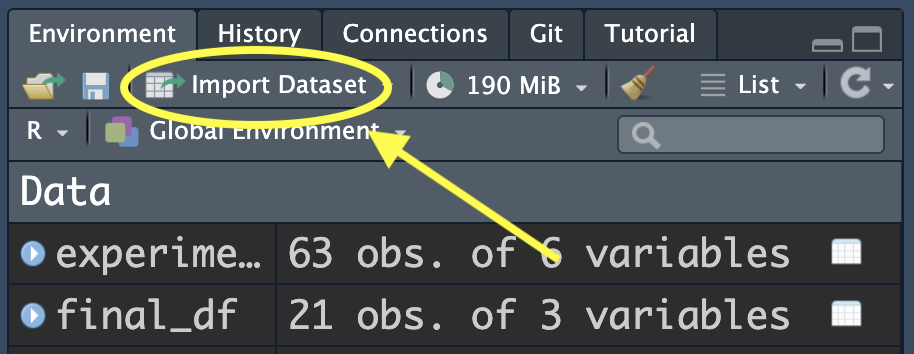
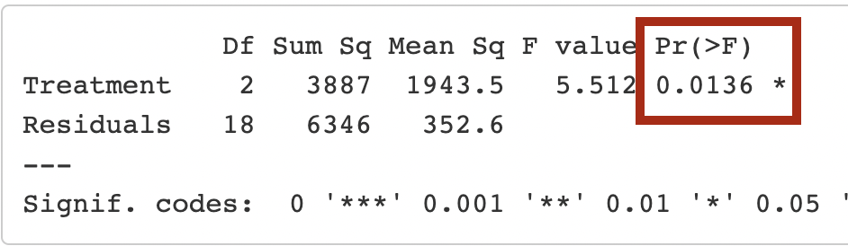

```{r setup, include=FALSE}
library(learnr)
library(dplyr)
library(ggplot2)
library(tidyr)
library(knitr)
library(kableExtra)
knitr::opts_chunk$set(echo = FALSE)
experiment <- read.csv('data/experiment_data.csv', 
                       header = T,
                       na.strings = "NA")
final_df<-experiment %>%
    filter(TimeGroup=="100hr") %>%
    select(Treatment,Lesion.mm,pH,TimeGroup)
```

```{css, echo=FALSE}
details summary { 
  cursor: pointer;
  color: rgb(154, 7, 7);
  font-size: 15px;
  font-style: italic;
  font-family: Georgia;
}
li{
  margin: 10px 0;
}
```

## Understanding the experiment
In this lesson, we will learn how to use Analysis of Variance (ANOVA) to test for statistically significant differences in means between multiple treatment groups. The data, and the description below, were generously provided by Dr. Grace Kwan.

#### Background

*Enzymes typically have optimal pH at which they work best. Above or below this optimal pH, the enzyme’s activity diminishes. Organisms may need to regulate the pH of their environment in order to ensure that their enzymes function optimally.*

*Pectobacterium carotovorum is a commonly found bacterial pathogen that rots plant tissues. This bacterium uses enzymes to break down plant cell walls, causing the plant cells to burst from osmotic pressure and release all of their water and nutrients – nutrients that support the continued growth of the bacterial pathogen. We often see this as slimy, watery lesions that rapidly consume whole fruits or vegetables.*

*This experiment assessed the importance of environmental pH on the ability of P. carotovorum to rot plant tissues. The enzymes that break down plant cell walls require a slightly basic pH. To ensure a favorable environment, P. carotovorum uses the BudB protein to limit acid production during metabolism by providing an alternate fermentation pathway that results in a product of neutral pH.*

### Experiment details
The experiment monitored several lettuce leaves within each treatment class:

* Three control leaves without bacteria (`Control`)
* Nine leaves inoculated with wild-type P. carotovorum (`wildtype`), and
* Nine leaves inoculated with $\Delta$budB mutant (`budB`).

At 20, 50, and 100 hours, disease progression was monitored as the length of the soft rot area in millimeters (`Lesion.mm`). At 100 hours, the soft rotted tissue was mashed up to evaluate the pH. 

***We are primarily interested in differences in lesion length and pH between the treatment groups at the end of the experiment.***


### Exploring the data
Recall from our video (INSERT LINK TO VIDEO!!!!) that our experiment data has been put in tidy format. Here is a link to a google sheet with the data for you to refresh your memory: <a href="https://docs.google.com/spreadsheets/d/14SjsEqxfG1aucubCJkq41gMLh47XJ5b2R1J0PMAkar4/edit?usp=sharing" target="_blank">Google Sheet of Experiment Data.</a> Recall there are two sheets:

* **tidy**: This sheet has our data in its tidy format
* **original**: This sheet has our data in its original format.

We have loaded *the tidy version* of our data into R under the data frame name `experiment`.

***

<details>
<summary> $\blacktriangleright$ Review Code for Loading Data...</summary>
The code for loading data into `R` depends on the format of the file (`.xslx`, `.csv`, `.tsv`, et cetera).  For those interested, here is code for loading our experiment data in CSV and Excel formats
```
# CSV format
experiment <- read.csv("location/file.csv", 
                        header = T)
# Example:
experiment <- read.csv("data/experiment.csv",
                        header = T)

# Excel
library(readxl)
experiment <- read_excel("location/file.xlsx",
                        sheet="sheet_name")
# Example:
experiment <- read_excel("data/experiment.xlsx",
                        sheet="tidy")
```
When in doubt, you can always use the "Import Dataset" button in the upper-right Environment Tab of R Studio:
<center></center>
</details>

***


Run the code block below to view the data and its format in `R`.  Remember you can use "Next" button in the lower right to see more rows of the data.
```{r p-value, exercise = TRUE, exercise.lines=3}
experiment
```

Notice that

* The data is in "tidy" format already. 
    * Each row corresponds to a measurement taken on a given leaf at a particular time point (20hr, 50hr, or 100hr).
    * Each endpoint metric, as well as the time variables (`TimeGroup` and `TimeValue`) and treatment labels, are stored in their own columns.
* Each endpoint metric, for example `pH`, has `NA` values whenever `TimeGroup` is not equal to 100 hours; this is because we do not measure pH until the end of the experiment.
    * In our <a href="https://docs.google.com/spreadsheets/d/14SjsEqxfG1aucubCJkq41gMLh47XJ5b2R1J0PMAkar4/edit?usp=sharing" target="_blank">google sheet</a>, we placed `NA` in these cells, but we could also have just left them blank.


> Important Idea: In order for the ANOVA code in this lesson to work properly, the data *must* be in tidy format!


```{r dependent-question}
question("Read the description of the \"Experiment Details\" once more. Of the variables in the data frame, which correspond to measurements that we will use to compare the treatment groups at the end of the experiment. *Select all that apply.*",
    answer("Leaf_ID"),
    answer("pH", correct = TRUE),
    answer("Treatment"),
    answer("TimeGroup"),
    answer("Lesion.mm",correct = TRUE),
    answer("Sample"),
    allow_retry = T,
    random_answer_order = T,
    incorrect = paste(random_encouragement(),"What metrics will we use to differentiate the treatment groups? See the \"Experiment Details\" section."),
    post_message = random_praise()
  )
```

```{r independent-question}
question("Which variable in the data frame identifies the groups we want to compare?",
    answer("Leaf_ID"),
    answer("pH"),
    answer("Treatment", correct = TRUE),
    answer("TimeValue"),
    answer("Lesion.mm"),
    answer("Sample"),
    allow_retry = T,
    random_answer_order = T,
    incorrect = paste(random_encouragement(),"Remember we are looking for differences between wild type, budB mutant, and the control. What variable helps us keep these groups straight?"),
    post_message = random_praise()
  )
```

### Great work so far!
We are now acquainted (or re-acquainted) with the data, and we have identified the appropriate variables of interest for our ANOVA. In the next sections, we will review the process of running an ANOVA to compare the mean lesion length at the end of the experiment for each treatment group. Our final section will provide an opportunity to test your skills by doing the same analysis with `pH` as the endpoint metric. 

Shall we get started?

## Quick ANOVA review {data-progressive=TRUE}

Let's get started with a quick review of analysis of variance.  ANOVA is a statistical hypothesis test used to "compare population means for several populations" based on evidence from samples collected from these populations. But what do we mean by "compare"?

As a hypothesis test, ANOVA is equipped with a *null hypothesis*, which we hope our samples will provide evidence ***against***.  For an ANOVA, the null hypothesis is

> $H_0$: the population means are equal across *all* groups.<br>  ($\mu_{_\text{group 1}} \ \ = \   \mu_{_\text{group 2}} \ \ = \  \mu_{_\text{group 3}} \ \ = \  \dots \ \ = \  \mu_{_\text{group $k$}}$)

As with all hypothesis tests, we either conclude by

* **rejecting $H_0$**: this implies our samples (more specifically, our *sample means*) provided enough evidence to suggest *at least one group mean* is different from the rest.
* **failing to reject $H_0$**: this implies our samples did not provide enough evidence to suggest that at least one of the group means is different at the population level.

<!-- ### A new perspective -->

To run an ANOVA in `R`, we need to identify two important variables from the data frame:

* **Independent variable:** this is typically a variable that researchers have some control over, and they purposely let it vary to test for some sort of response in the *dependent variable.*
    * The *independent variable* is sometimes called the *explanatory variable*; we hope to find that it helps "explain" variation in the response variable.

* **Dependent variable:** this is typically a variable that researchers use to measure the response to differences in an *independent variable*. The researchers cannot (and should not) control what this variable is doing!
    * The *dependent variable* is sometimes called the *response variable*; we hope to find that it "responds" to differences in the explanatory variable.

<!-- When looking for an association, we are simply asking: -->

<!-- > Does knowing something about the **independent variable** give us information about what will happen with the **dependent variable**? If the answer is *yes*, we consider that an association. -->

For an ANOVA, we also require (among other assumptions) that:

* the *independent variable* is a categorical (grouping) variable, with at least three potential levels (groups); and
* the *dependent variable* is a quantitative (numeric) variable.

Return to the details of our experiment and answer the questions below.

<!-- So translating the ideas above, an ANOVA attempts to answer either of the following questions: -->

<!-- > Does knowing something about a *grouping variable* give us information about a *quantitative measurement*? -->

<!-- > Is there an association between a *grouping variable* and a *quantitative measurement*? -->

```{r grouping-question}
question("In the P. carotovorum experiment, what variable from the data frame do we think of as the researcher controlling and varying for the purpose of looking for some sort of response?<br></br> In other words, what is the *independent* (or explanatory) variable?",
    answer("Sample"),
    answer("pH"),
    answer("Treatment", correct = TRUE),
    answer("Lesion.mm"),
    answer("TimeValue"),
    allow_retry = T,
    random_answer_order = T,
    incorrect = paste(random_encouragement(),"Remember we inoculated lettuce leaves with different bacteria: wild type, budB mutant, and the control (no inoculation). What variable helps us keep these groups straight?"),
    post_message = paste(random_praise(), "The `Treatment` variable is our independent variable for this experiment. We might also call it our grouping variable, if we already know we are running an ANOVA.")
  )
```

```{r response-question}
question("In the P. carotovorum experiment, what variable or variables from the data frame do we think of as measuring a *response* to changes administered by the researcher? <br></br> In other words, what are possible *dependent* (or response) variables?<br></br> *Select all that apply*.",
    answer("Sample", message=paste(random_encouragement(),"Remember the effectiveness of P. carotovorum in rotting the leaf can be monitored by the growth/size of rot lesion, and we expect that bacteria in certain groups will also try to control the pH of the rot lesion.")),
    answer("pH", correct = TRUE),
    answer("Treatment", message=paste(random_encouragement(),"Remember the effectiveness of P. carotovorum in rotting the leaf can be monitored by the growth/size of rot lesion, and we expect that bacteria in certain groups will also try to control the pH of the rot lesion.")),
    answer("Lesion.mm", correct = TRUE),
    answer("TimeGroup", message = "While the experiment does have a time-component, we do not think of time as measuring some sort of response on the leaves we inoculated with bacteria."),
    allow_retry = T,
    random_answer_order = T,
    post_message = paste(random_praise(), "The `pH` and the `Lesion.mm` are potential dependent variables for this experiment. This means we could run two ANOVAs <ul> <li> one comparing how pH responds to Treatment, and</li> <li>one comparing how lesion length responds to Treatment.</li></ul>")
  )
```

#### Keep up the great work!

## Getting ready{data-progressive=TRUE}
In the previous section we determined our data for the *P. carotovorum* experiment could potentially inform *two* different ANOVAs.  For demonstration, we will focus on the ANOVA where the

* **Independent (explanatory) variable** is `Treatment`, identifying the groups of lettuce leaves that were inoculated differently (or not at all, as is the case with the control); and
* **Dependent (response) variable** is `Lesion.mm`, a response measuring the efficacy of the inoculated bacteria at rotting the leaf.

We will save the ANOVA involving `pH` for the review exercises.

Many `R` functions, and statistical analyses, require the researcher to specify the independent and dependent variables in their code.  In `R`, we can do this quickly using the syntax 

<center>`dependent_var ~ indendent_var`. </center>

So, for our case, we will often see code that uses `Lesion.mm ~ Treatment`.

### Preparing our analysis data frame
Recall that we are only analyzing data from the *end of the experiment.* This means we want rows where `TimeGroup` equals (`==`) the "100hr" mark. To prepare our data set, we want to

* Use the `filter()` command to to keep only rows with data from the end timepoint of the experiment; and
* Use the `select()` command to keep the `Treatment`, `Lesion.mm`, `TimeGroup`, and `pH` variables.

***

*Quick Syntax Notes*: 

* When doing comparisons in `R`, everything is case-sensitive and also sensitive to spaces (or extra spaces).  
    * For example, all of the following are different in `R`: `"20hr"`, `"20 hr"`, and `"20HR"`.<br></br>
* Variable names (i.e., the columns of your data frame) do not require quotes. 
    * For example, we do not need quotes when using `Lesion.mm` in our code.<br></br>
* The *levels* (or groups) of a categorical variable ***do*** require quotes. 
    * For example, to specify the twenty hour group, we need `"20hr"` in our code.
    
***


#### Exercise!
Please write your code below to select *only* the information you need. Remember we want to 

*  `filter()` to keep only rows with data from the end of the experiment; and
*  `select()` the `Treatment`, `Lesion.mm`, `TimeGroup`, and `pH` variables.


```{r filter, exercise = TRUE, exercise.lines=3}
experiment %>%
    filter(...) %>%
    select(...)
```
```{r filter-hint-1}
experiment %>%
    filter(...) %>%
    select(Treatment, TimeGroup, Lesion.mm, pH)
```
```{r filter-hint-2}
experiment %>%
    filter(TimeGroup == "...") %>%
    select(Treatment, TimeGroup, Lesion.mm, pH)
```
```{r filter-solution}
experiment %>%
    filter(TimeGroup == "100hr") %>%
    select(Treatment, TimeGroup, Lesion.mm, pH)
```
**Answer Check:** There should be 21 rows in this data frame, and four columns. Moreover, *every* entry for `TimeGroup` should be `"100hr"`.

We have stored this data frame under the shortcut name `final_df`. We will use it for the rest of the sections and exercises. For now, we will focus on `Lesion.mm` as our dependent variable and pursue that particular ANOVA. We will not use `pH` until the review exercises.

#### Great work!
In the next two sections, we will fit an ANOVA and explore the whether there are differences in the mean lesion length among our three treatment groups: `"wildtype`, `"budB"`, and `"Control"`.

Here we go!

## Running an ANOVA {data-progressive=TRUE}
```{r aov-setup, include = FALSE}
experiment %>%
    filter(TimeGroup == "100hr") %>%
    select(Treatment, Lesion.mm, pH)->final_df
lesion.aov<-aov(Lesion.mm ~ Treatment, data = final_df)
```

In `R`, we use the `aov()` function to "fit" an ANOVA.  In its simplest application, which is fine for us, it uses two arguments:

* `formula`: which we use to specify the dependent and independent variables (`Lesion.mm ~ Treatment`), and
* `data`: which we use to identify the data frame with our data (`final_df`).

The syntax is `aov(depend_var ~ indep_var, data = df_name)`.

#### Exercise: Fit an ANOVA!
Fill in the code below to fit an ANOVA and save the output to the name `lesion.aov`.  The last line calls the saved output so you can see that it worked.
```{r aov1, exercise = TRUE, exercise.lines=3, exercise.setup="aov-setup"}
lesion.aov <- aov(...)
lesion.aov
```
```{r aov1-hint-1}
lesion.aov <- aov(..., data = final_df)
lesion.aov
```
```{r aov1-hint-2}
lesion.aov <- aov(Lesion.mm ~ ..., data = final_df)
lesion.aov
```
```{r aov1-solution}
lesion.aov <- aov(Lesion.mm ~ Treatment, data = final_df)
lesion.aov
```
**Answer Check:** You should see some output, but perhaps not what you were expecting.  If this worked, however, you will find `Residual standard error: 18.77679`.

### ANOVA results and interpretation
Yes... we're all thinking the same thing.  ***Where's my $P$-value!?***

The default report from the `aov()` function does not report a $P$-value, but we can get it easily.  Since we saved the ANOVA output under the name `lesion.aov`, we can use other functions to extract more information.

One such function is `summary()`, which will create a standard ANOVA table, and also report our $P$-value for the hypothesis test.

#### Exercies: extract the ANOVA table and the $P$-value
Put our saved ANOVA, `lesion.aov`, inside the `summary()` function to see a new output!
```{r get-p, exercise = TRUE, exercise.lines=3, exercise.setup="aov-setup"}
summary(...)
```
```{r get-p-solution}
summary(lesion.aov)
```
**Answer Check**: You should see a new output table with a value of `0.0136` below a column heading of `Pr(>F)`.

### Interpreting our summary output
So, *where the $P$-value*?  Great question!

It's not obvious, but the value below the column heading `Pr(>F)` is the $P$-value for this ANOVA. 

<center></center>

So, for our ANOVA involving potential differences in mean lesion length between our treatment groups, *we have a $P$-value of 0.0136.* But, what does that ***mean***? 

In general, researchers follow these "guidelines":

* If the $P$-value is below 0.05, we have evidence to reject the null hypothesis.
* If the $P$-value is above 0.05, there is not enough evidence to reject the null hypothesis.

(Notice that the language we use here is strongly suggestive, but not certain. We never *prove* anything with a hypothesis test; rather, we provide evidence or fail to provide evidence.)

Use this guide to sort through the proper conclusion below.
```{r reject-question}
question("Keep in mind that the null hypothesis for an ANOVA is that *all* the group means are equal to each other. Given that our $P$-value is 0.0136, what should we conclude?",
    answer("The test fails because our $P$-value does not equal 0.05.", message="This is not one of our potential conclusions; revisit the two options above."),
    answer("We have evidence to reject the null hypothesis and conclude that *all* the group means are different.", message="We do have evidence to reject the null hypothesis. However, while the null hypothesis assumes all group means are equal, rejecting this claim does not require that each group mean is different from the rest. We can reject this claim in less extreme situations.<br></br> Assuming it is not the case that *all* group means are equal, what is the minimal number of group means that needs to be different from the rest?"),
    answer("We have failed to reject the null hypothesis; we proved the group means are all equal.", message = "Our $P$-value (0.0136) is smaller than 0.05. What that that mean for our null hypothesis?"),
    answer("We have evidence to reject the null hypothesis. So our evidence suggests that *at least one* of the group means is different.", correct = TRUE),
    answer("We do not have enough evidence to reject the null hypothesis. Our evidence does not support any difference in the group means.", message = "Our $P$-value (0.0136) is smaller than 0.05. What that that mean for our null hypothesis?"),
    allow_retry = T,
    random_answer_order = T,
    post_message = random_praise()
  )
```

### Great work!
So far we have 

1. Identified our independent and dependent variables (`Treatment` and `Lesion.mm`, respectively);
2. Prepared our data frame (filtering appropriate rows, selecting important columns, and checking it is in tidy-format);
3. "Fit" our ANOVA and saved the output (`lesion.aov`), and then found the $P$-value (0.0136) by running `summary(lesion.aov)`.
4. Understood the results of the test: *The samples provide sufficient evidence to suggest that **at least one** (possibly more) group mean is different from the rest, at the population level.*

In the context of our data, this means that our experiment suggests the following:

> At the population level (so extending beyond just the data we collected), *at least one* treatment group will have a different mean lesion length after 100 hours than the others.

Great! But... 

* Which group? 
* Is it just one group that's different, or more?  
* For a group that does have a different mean, is it larger or smaller than the other group means?

To answer these questions, we need a "post hoc" (after the event) test called Tukey's Honest Significant Difference Test.

One more section; let's keep learning!

***
***

<details>
<summary> $\blacktriangleright$ Optional note on "*population level*" </summary>
It's a little odd to use the language of "population level mean" for experiments like this.  One way to interpret this is in terms of *reproducibility*, which scientists seem to like. Recall our conclusion:

*At the **population level** (so extending beyond just the data we collected), at least one treatment group will have a different mean lesion length after 100 hours than the others.*

We are simply implying that this particular experiment, combined with the ANOVA results, suggests that if we were to run the experiment several more times (*reproduce it*), we would expect to see similar results of at least one group mean being different.

With this implication, that reproducing the experiment would not change the results, we are suggesting the difference we are detecting is a feature of the *populations* from which we draw, and not particular samples. Since each reproduction of the experiment would draw from the same populations, we would not expect the results to vary in a significant way.
</details>

## Tukey's Honest Significant Difference Test
The ANOVA results ($P$-value = 0.0136 < 0.05) give us reason to believe that *at least one* population group mean is different from the others.  Running Tukey's Test will help us answer more interesting questions. **But**, we should only run a post-hoc test (like Tukey's) if we first verify that our ANOVA is significant (i.e., $P$-value $< 0.05$).

#### Tukey's test, quick summary
Tukey's Honest Significant Difference test (Tukey's HSD) essentially runs all possible pair-wise tests for differences in means, but makes adjustments to avoid problematic increases in Type I Error rates. For our data, Tukey's HSD would run three tests:^[When your grouping variable has more than three groups, the number of combinations increase quite quickly. For example, 10 treatment groups leads to 45 pair-wise comparisons.]

* Difference in means comparing `"wildtype"` and `"Control"`
* Difference in means comparing `"wildtype"` and `"budB"`
* Difference in means comparing `"budB"` and `"Control"`

For each of these tests, Tukey's HSD will return "adjusted" information; both an adjusted $P$-value, and an adjusted confidence interval for the difference in means.

* We can use the $P$-values to determine if there is a difference between a given pair; as usual, we look for adjusted $P$-values below 0.05.
* We can use the confidence intervals to determine which group mean is larger.  
    * For example, if we compare `"wildtype"` minus `"Control"`, and the confidence interval for the difference in means is entirely positive, it suggests the group mean lesion length for `"wildtype"` type will be bigger than the group mean for `"Control"`.
    
### Running Tukey's HSD
Luckily, it is very easy to run Tukey's test in `R`. Recall that we have `lesion.aov` storing our ANOVA output for the ANOVA based on the `Lesion.mm` variable.  Simply put this inside the `TukeyHSD()` function.  
```{r tukey, exercise = TRUE, exercise.lines=3, exercise.setup="aov-setup"}
#place your code here
```
```{r tukey-hint-1}
TukeyHSD(...)
```
```{r tukey-solution}
TukeyHSD(lesion.aov)
```

### Interpreting TukeyHSD Output
The most important information appears in the table output.  Each row corresponds to a pairing of treatment groups, and the difference of means test was computed using that order.  For example, the row labeled `Control-budB` gives information on the difference of means test where we look at the mean lesion length for `"Control"` minus the mean lesion length for `"budB"`.

The last column consists of our adjusted $P$-values. The `wildtype-budB` comparison, for example, has an adjusted $P$-value of 0.058.

```{r}
TukeyHSD(aov(Lesion.mm~Treatment, final_df))$Treatment %>%
    kable(table.attr = "style='width:85%;'") %>%
    kable_styling() %>%
    row_spec(3, color='black') %>%
    row_spec(1, color = "black",
             background = "#bdc3fc"#,
             #popover = paste("am:", mtcars$am[1:8])
    ) %>%
    row_spec(2, color = "black",
             background = "#6cd989"#,
             #popover = paste("am:", mtcars$am[1:8])
    ) %>%
    column_spec(2:4, color='#ededeb') %>%
    column_spec(5, bold=T)
```


Any row with an adjusted $P$-value *below* 0.05 indicates a test that provides evidence for a difference in means *between these two groups*. 

```{r pairwise-p-question}
question("Between which two groups did Tukey's HSD detect a significant difference in means? Use a significance level (i.e. $P$-value threshold) of 0.05.",
    answer("wildtype-budB", message = "This has an adjusted $P$-value of 0.058, which is not below 0.05. However, we do admit that this is *close*, and probably should raise an eyebrow on the researcher."),
    answer("wildtype-Control", correct = TRUE),
    answer("Control-budB", message = "This has an adjusted $P$-value of 0.47, which is not below 0.05."),
    answer("wildtype-Control-budB", message = "This isn't a comparison that Tukey's test does."),
    allow_retry = T,
    random_answer_order = T,
    incorrect = paste(random_encouragement(),"Review the discussion of Tukey's Test and $P$-values above, then give it another try!"),
    post_message = random_praise()
  )
```

#### Confidence intervals
The middle two columns of Tukey's output report confidence intervals for the difference in means *taken in the order of the row label.*

```{r}
TukeyHSD(aov(Lesion.mm~Treatment, final_df))$Treatment %>%
    kable(table.attr = "style='width:85%;'") %>%
    kable_styling() %>%
    row_spec(3, color='black') %>%
    row_spec(1, color = "black",
             background = "#bdc3fc"#,
             #popover = paste("am:", mtcars$am[1:8])
    ) %>%
    row_spec(2, color = "black",
             background = "#6cd989"#,
             #popover = paste("am:", mtcars$am[1:8])
    ) %>%
    column_spec(c(2,5), color='#ededeb') %>%
    column_spec(3:4, bold=T)
```


For example, Tukey's test estimates the difference between the population mean lesion length for `"Control"` *minus* the population mean lesion length for `"budB"` falls between $-46.9$ mm and 16.9 mm.

* This interval contains zero, so it remains possible that the difference in the populations means is zero (i.e., no difference). This aligns with the $P$-value above 0.05, hence failing to detect a difference in means for this pair.

```{r pairwise-ci-question}
question("Considering the Tukey HSD output, which comparisons have a confidence interval that *contains* zero? <br> *Select all that apply*",
    answer("wildtype-budB",correct=TRUE),
    answer("wildtype-Control", message = "The lower limit of this confidence interval, `wildtype-Control`, is about 4, which avoids zero."),
    answer("Control-budB", correct = TRUE),
    answer("Control-wildtype-budB", message = "`Control-wildtype-budB` isn't a comparison that Tukey's test does."),
    allow_retry = T,
    random_answer_order = T,
    post_message = random_praise()
  )
```

### Conclusion
Based on the ANOVA, as well as the output of Tukey's test, we can improve on our conclusions for this experiment:

* We have evidence that at least one treatment group has a different mean lesion length than the other groups.
    * Further, a post-hoc Tukey HSD finds sufficient evidence of a difference in mean lesion length between `"Control"` leaves and `"wildtype"`-inoculated leaves.
    * The post-hoc test did not find sufficient evidence of a difference in means between `"budB"` and the other two groups.

### Excellent Job!
We have learned so much in the past few sections.  Are you ready to test your knowledge?

The last section allows you to practice running an ANOVA, a Tukey HSD, and reflect on the results.  This time, we focus on `pH` as an endpoint metric for comparing the `Treatment` groups. Feel free to move back and forth through these previous sections to review code and interpretations.

Challenge accepted? Onward!

***
***

<details>
<summary> $\blacktriangleright$ Optional note: but which is *bigger?* </summary>

We could add more detail to the conclusion above, but notice we now provide more information than just saying "*at least one group mean is different*".

We can go one step further. Notice that our confidence interval for `wildtype-Control` is 4.9 mm to 68.8 mm. This is estimating the difference in means of `"wildtype"` minus `"Control"`, and it is entirely positive! This suggests that the `"wildtype"`-inoculated leaves have a larger mean lesion length than the control.  This is indicative of more disease severity.

</details>

## Practice exercises {data-progressive=TRUE}
Recall from the abstract of this experiment that

*Enzymes typically have optimal pH at which they work best. Above or below this optimal pH, the enzyme's activity diminishes. Pathogens may need to regulate the pH of their environment in order to ensure that their enzymes function optimally. *

Based on this, a researcher might expect that the leaves inoculated with `wildtype` P. carotovorum would attempt to control the pH on the leaf.  Rather than focusing only on the `wildtype` group, let's consider all three treatment groups.

### Fitting the ANOVA, printing output
In the code-chunk below, do the following:

1. Fit an ANOVA that explores how `pH` may be associated with `Treatment` groups; save the output to `pH.aov`.
2. Print the appropriate summary to find the $P$-value of this ANOVA.

We can use `final_df` for our data set, since we included `pH` in the variables.
```{r ph-anova, exercise = TRUE, exercise.lines=5}
# Code for 1

# Code for 2

```
```{r ph-anova-hint-1}
# Code for 1
pH.aov <- aov(..., data = final_df)
# Code for 2

```
```{r ph-anova-hint-2}
# Code for 1
pH.aov <- aov(pH~Treatment, data = final_df)
# Code for 2
summary(...)

```
```{r ph-anova-solution}
# Code for 1
pH.aov <- aov(pH~Treatment, data = final_df)
# Code for 2
summary(pH.aov)

```

#### Interpreting ANOVA results
Using the output from above, answer the questions below to inform your interpretation of this ANOVA, and the experiment details.
```{r anova-review-quiz}
quiz(
    # Question 1
    question_numeric(
    "What is the $P$-value associated to the ANOVA? (*NOT the Tukey tests*)<br> *Please round to five decimal places.*",
    answer(0.000327, message = "Too many digits; five decimal places please."),
    answer(0.003, message = "One more digit please."),
    answer(0.00327, message="You dropped a zero...."),
    answer(0.01859, message = "Not a Tukey adjusted P-value; the ANOVA please."),
    answer(0.0875, message = "This is not the P-value; it was taken from the wrong column of the ANOVA output table. Look for Pr(>F)."),
    answer(0.90495, message = "Not a Tukey adjusted P-value; the ANOVA please."),
    answer(0.00033, correct = TRUE),
    allow_retry = TRUE,
    # min = 3,
    # max = 4,
    step = 0.00001
    ),
    # Question 2
    question("Based on your $P$-value for the ANOVA, our data ...",
    answer("provides sufficient evidence to reject the null hypothesis.  We have evidence that the mean pH for all three groups are different from each other.", message="They do not all have to be different."),
    answer("fails to provide enough evidence to reject the null hypothesis. We *do not* have evidence of any differences in mean pH these groups.", message="Is your $P$-value below 0.05? If so, you should be rejecting the null hypothesis."),
    answer("provides sufficient evidence to reject the null hypothesis.  We have evidence that the mean pH is different for *at least one* group.", correct = TRUE),
    answer("fails to provide enough evidence to reject the null hypothesis. We proved the group means are all equal.", message = "Is your $P$-value below 0.05? If so, you should be rejecting the null hypothesis. Also, hypothesis tests do not 'prove' anything; we are always providing evidence or failing to provide evidence."),
    answer("An ANOVA, analysis of *variance*, tests differences in variance, not means.", message="Not quite. It uses variances to test for differences in means, but it does fundamentally test for differences in means."),
    allow_retry = T,
    random_answer_order = T,
    post_message = random_praise()
  )
  
)
```

### Tukey HSD and interpretation
Assume that the ANOVA results have been saved as `pH.aov` (*Note:* the H is capitalized!).
```{r ph-tukey-setup}
pH.aov <- aov(pH~Treatment, data = final_df)
```

```{r ph-tukey, exercise = TRUE, exercise.lines=2, exercise.setup="ph-tukey-setup"}
# place code here
```
```{r ph-tukey-hint-1}
TukeyHSD(...)

```
```{r ph-tukey-solution}
TukeyHSD(pH.aov)
```

```{r tukey-review-quiz}
quiz(
    question("According to the results of Tukey's HSD, for which group-pairs do we have evidence for a difference in mean pH?<br> *Select all that apply*.",
    answer("Control-budB", message="For Control-budB, is the $P$-value below 0.05? Double check...."),
    answer("wildtype-budB", correct = TRUE),
    answer("wildtype-Control", correct = TRUE),
    allow_retry = T,
    random_answer_order = T,
    post_message = random_praise()
  ),
  
  question_text(
  "Based on the previous questions, *write your own conclusion* for this analysis of the potential association between pH and Treatment.  Specifically address the ANOVA results, as well as the Tukey HSD results (if you had to run one). <br></br> Submit your conclusion to see an example written by us!",
  answer_fn(function(value) {
    if (grepl(".*", value)) {
      correct("Great work writing your own conclusion! How does your conclusion compare with ours?")
    }
  }), message="*An ANOVA indicated that we have evidence at least one treatment group (`\"wildtype\"`,`\"budB\"`,`\"Control\"`) had a different mean pH when compared to the others.  The results of a post-hoc test, Tukey's HSD, gave evidence that `\"wildtype\"` had a different mean pH than both `\"Control\"` and `\"budB\"`. We did not find evidence for a difference in mean pH when comparing `\"budB\"` and `\"Control\"`.*"
)
)
```

### Bonus: which is bigger?
Focus now on the confidence interval output from the Tukey Test:
```{r}
TukeyHSD(aov(pH~Treatment, data = final_df))$Treatment[,c(2,3)]
```

Recall that the confidence interval estimates the difference in population means between the two groups, *in the order they are presented*.  With that in mind, answer the following questions comparing the size of the mean pH between the groups presented.

```{r bigger-questions}
quiz(
   question("Considering the comparison between `\"Control\"` and `\"budB\"`, what does the Tukey confidence interval for difference in means suggest?",
    answer("The mean pH for `\"Control\"` is bigger than `\"budB\"`.", message="The order is Control minus budB. Is the confidence interval entirely *positive*? That's what we would require for this sentence to be true."),
    answer("The mean pH for `\"budB\"` is bigger than `Control`.",message="The order is Control minus budB. Is the confidence interval entirely *negative*? That's what we would require for this sentence to be true."),
    answer("We failed to provide enough evidence to suggest a difference between the means of these groups.", correct = TRUE),
    allow_retry = T,
    random_answer_order = T,
    post_message = random_praise()
  ),
  
  question("Considering the comparison between `\"wildtype\"` and `\"budB\"`, what does the Tukey confidence interval for difference in means suggest?",
    answer("The mean pH for `\"wildtype\"` is bigger than `\"budB\"`.",
           correct=TRUE),
    answer("The mean pH for `\"budB\"` is bigger than `\"wildtype\"`.",message="The order is wildtype minus budB. Is the confidence interval entirely *negative*? That's what we would require for this sentence to be true."),
    answer("We failed to provide enough evidence to suggest a difference between the means of these groups.", message="Does the confidence interval contain zero? That's what we would require for this sentence to be true."),
    allow_retry = T,
    random_answer_order = T,
    post_message = random_praise()
  ),
  
  question("Considering the comparison between `\"wildtype\"` and `\"Control\"`, what does the Tukey confidence interval for difference in means suggest?",
    answer("The mean pH for `\"wildtype\"` is bigger than `\"Control\"`.",
           correct=TRUE),
    answer("The mean pH for `\"Control\"` is bigger than `\"wildtype\"`.",message="The order is wildtype minus Control. Is the confidence interval entirely *negative*? That's what we would require for this sentence to be true."),
    answer("We failed to provide enough evidence to suggest a difference between the means of these groups.", message="Does the confidence interval contain zero? That's what we would require for this sentence to be true."),
    allow_retry = T,
    random_answer_order = T,
    post_message = random_praise()
  ) 
    
)
```


### Excellent work!
Congratulations on working through these exercises on running and interpreting ANOVA results in `R`!


